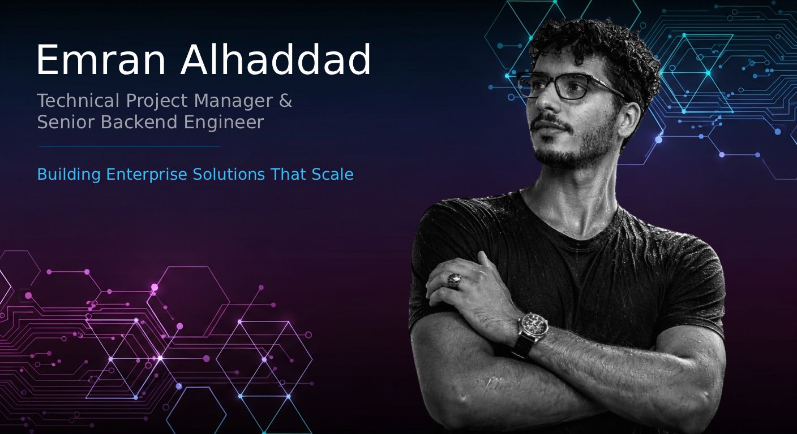

  

# Emran Alhaddad

### Technical Project Manager & Senior Backend Engineer

<em><b>Building Enterprise Solutions That Scale<b></em>

## About Me

I'm a Jeddah‑based **Technical Project Manager & Senior Backend Engineer** with a track record of delivering high‑performance systems for enterprise clients.  My expertise spans backend development, API architecture, cloud infrastructure, DevOps and project management.  At
[Brackets Technology](https://brackets-tech.com) I design scalable backend architectures for energy, banking, logistics and industrial sectors; develop GraphQL and RESTful APIs to improve data efficiency; and lead cloud migration and CI/CD automation using Docker, Kubernetes and AWS.  My role also includes coordinating front‑end, UX and system teams and driving security and performance improvements across multiple projects.

Prior to that, I served as a **Senior Backend Developer at Otek** where I built and optimized backend architectures for more than twenty enterprise applications, delivering secure API solutions for fintech, logistics and e‑commerce platforms, improving database performance by 40 % and automating 40 % of backend processes.  Since 2020 I've also worked as a freelance full‑stack developer, designing custom SaaS and fintech solutions, developing scalable RESTful and GraphQL APIs and leading cloud deployments using AWS, DigitalOcean and Kubernetes.

I hold a **Bachelor of Software Engineering** from Taiz University (GPA 3.7, 2021) and a **Full Stack Web Development certification** from ROWAD Coding Academy.  I'm fluent in Arabic and have professional working proficiency in English.

## Core Skills & Expertise

| Category             | Technologies & Tools                                     |
|---------------------|-----------------------------------------------------------|
| **Backend**         | Laravel, PHP, Node.js                                     |
| **API Development** | GraphQL, RESTful, API Gateway                              |
| **DevOps & Cloud**  | AWS, DigitalOcean, Docker, Kubernetes, CI/CD              |
| **Databases**       | MySQL, PostgreSQL, MongoDB                                |
| **Project Mgmt.**   | Agile, Scrum, SDLC, Jira                                  |
| **Performance & Security** | Query optimisation, caching, API security            |

### Tech Stack & Tools

<code></code>
<code></code>
<code></code>
<code></code>
<code></code>
<code></code>
<code></code>
<code></code>

## Experience Highlights

- **Energy & industrial sector solutions –** designed and optimized backend architectures and APIs for clients such as *Luberef (Saudi Aramco Base Oil)*, *TotalEnergies KSA*, *Jeddah Historic District* and *Hadeed (SABIC)*, focusing on data management, corporate content and high‑traffic public portals.
- **Banking & finance platforms –** developed secure platforms for Saudi banks and the Bayanat Platform (financial data submission system), providing secure data handling, API integration and automated processing.
- **Logistics & e‑commerce systems –** built inventory and service management APIs for *Juffali Trucks* and *Connect Unlocker* and improved query performance and caching for multiple e‑commerce clients.
- **High‑traffic event applications –** engineered a backend for the *Sand & Fun Airshow 2024* capable of handling over **100,000 concurrent visitors**.

## Open Source Projects

I maintain and contribute to several open‑source projects.  Here are a few of the most notable repositories on my GitHub profile.

| Repository | ⭐ Stars | Description |
|-----------|:------:|------------|
| **[Saudi Riyal Font](https://github.com/emran-alhaddad/Saudi-Riyal-Font)** | **96:contentReference[oaicite:14]{index=14}** | Official open‑source font providing the Saudi Riyal currency symbol.  It works across Windows, macOS, Linux, web and mobile platforms and includes `.woff`, `.woff2` and `.ttf` formats:contentReference[oaicite:14]{index=14}.  Features include a private Unicode code point, NPM package, CDN hosting and a permissive OFL license:contentReference[oaicite:15]{index=15}.  GitHub shows it has 96 stars and 27 forks:contentReference[oaicite:16]{index=16}. |
| **[Smart Image Hotspots](https://github.com/emran-alhaddad/smart-image-hotspots)** | **4:contentReference[oaicite:14]{index=14}** | Statamic addon that lets you add hotspots to images and save their positions in percentages.  It supports SVG images, provides Antlers tags for templates and includes GraphQL support to query hotspot data:contentReference[oaicite:17]{index=17}.  The repository has 4 stars and 2 forks:contentReference[oaicite:18]{index=18}. |
| **[QR Code Generator](https://github.com/emran-alhaddad/qrcode-generator)** | **2:contentReference[oaicite:14]{index=14}** | Simple web tool to generate QR codes instantly.  Just drop your URL and a QR code is generated in seconds; the tool is free and hassle‑free:contentReference[oaicite:19]{index=19}.  The repository currently has 2 stars and 1 fork:contentReference[oaicite:20]{index=20}:contentReference[oaicite:21]{index=21}. |
| **[Statamic Content Sync](https://github.com/emran-alhaddad/statamic-content-sync)** | **2:contentReference[oaicite:14]{index=14}** | Statamic addon that provides export and import of collections, navigation trees, taxonomies, assets and globals via a control panel UI.  It offers smart pickers, delta‑friendly exports, Git‑style diffs and granular decisions, with CLI commands for automation:contentReference[oaicite:22]{index=22}.  The GitHub repository lists 2 stars and 1 fork:contentReference[oaicite:23]{index=23}. |

<em>Star counts are as of September 2025 and reflect the public GitHub statistics for each project.</em>

## Get in Touch

I'm always open to new opportunities, collaborations and contributions.  Feel free to reach out via the following channels:

- **Email:** [emran.alhaddad.dev@gmail.com](mailto:emran.alhaddad.dev@gmail.com)
- **LinkedIn:** [linkedin.com/in/emran-alhaddad](https://linkedin.com/in/emran-alhaddad)
- **Twitter/X:** [@emran_alhaddad](https://twitter.com/emran_alhaddad)
- **GitHub:** [emran‑alhaddad](https://github.com/emran-alhaddad)

## GitHub Statistics & Insights

Dynamic widgets transform your profile into a living résumé.  Tools like `github-readme-stats` let you display contributions, stars, forks and language usage directly in Markdown:contentReference[oaicite:26]{index=26}, while `github-readme-activity-graph` visualises your activity over the last 31 days.  The GitHub Readme Streak Stats and Profile Trophy widgets show your current contribution streak and highlight your ranking across metrics:contentReference[oaicite:28]{index=28}.

  <!-- Overall stats -->
  
  <!-- Top languages -->
  
   
  <!-- Contribution streak -->
  
   
  <!-- Activity graph -->
  
   
  <!-- Trophies -->
  

## How I Work

I follow clean architecture and SOLID principles, keeping controllers slim and business logic encapsulated in services and repositories.  My workflows emphasise **continuous integration**, **automated testing** and **code reviews**.  When leading a project I encourage collaboration, clear communication and knowledge sharing.

## Final Thoughts

Open‑source allows us to give back to the community.  If you use any of my projects, please consider ⭐ starring the repository, submitting issues or contributing improvements.  I’m excited to continue building innovative tools and collaborating with developers around the world.
