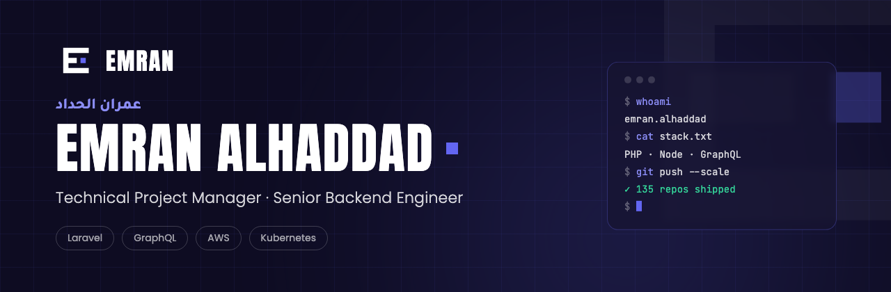

<!-- ====================== BANNER ====================== -->

  

<!-- ====================== TYPING INTRO ====================== -->

  

<!-- ====================== BADGES ====================== -->

  
  
  
  
  

  
  
  

---

## `> whoami`

I'm a Jeddah-based **Technical Project Manager & Senior Backend Engineer** shipping high-performance systems for enterprise clients across **energy, banking, logistics, and industrial** sectors. At [**Brackets Technology**](https://brackets-tech.com) I architect scalable backends, design GraphQL & REST APIs, and lead cloud migration and CI/CD automation with Docker, Kubernetes, and AWS while coordinating front-end, UX, and systems teams.

- 🔭 **Now:** Technical PM & Senior Backend Engineer @ [Brackets Technology](https://brackets-tech.com)
- ⚙️ **I build:** scalable APIs, cloud infrastructure, and the systems that keep enterprise products fast and secure
- 🏆 **Open source:** author of the [**Saudi Riyal Font**](https://github.com/emran-alhaddad/Saudi-Riyal-Font) — the official open-source font for the new Saudi Riyal symbol (136★, used across web, desktop & mobile)
- 🌐 **Bilingual:** Arabic (native) · English (professional) — I ship products in both, RTL-first
- 🎓 **B.Sc. Software Engineering**, Taiz University (GPA 3.7)
- 📫 **Reach me:** emran.alhaddad.dev@gmail.com

---

## `> cat tech-stack.txt`

  

| Domain | Stack |
|---|---|
| **Backend** | Laravel · PHP · Node.js |
| **APIs** | GraphQL · REST · API Gateway |
| **Databases** | MySQL · PostgreSQL · MongoDB · Redis |
| **DevOps & Cloud** | AWS · DigitalOcean · Docker · Kubernetes · CI/CD |
| **Practice** | Agile · Scrum · SOLID · Clean Architecture · API security |

---

## `> ls featured-projects/`

| Project | What it is | Stars |
|---|---|:---:|
| 🏛️ [**Saudi Riyal Font**](https://github.com/emran-alhaddad/Saudi-Riyal-Font) | Official open-source font for the Saudi Riyal currency symbol — cross-platform (`woff` / `woff2` / `ttf`), NPM + CDN, private Unicode code point, OFL license |  |
| 🔄 [**Statamic Content Sync**](https://github.com/emran-alhaddad/statamic-content-sync) | Export/import collections, taxonomies, navs, assets & globals with Git-style diffs, smart pickers, and CLI automation |  |
| 🛡️ [**Statamic GraphQL Protect**](https://github.com/emran-alhaddad/statamic-graphql-protect) | Adds query depth/complexity limits and access control to harden Statamic GraphQL endpoints |  |
| 🖼️ [**Smart Image Hotspots**](https://github.com/emran-alhaddad/smart-image-hotspots) | Statamic addon for percentage-based image hotspots with Antlers tags and GraphQL support |  |
| 📓 [**Statamic Logbook**](https://github.com/emran-alhaddad/statamic-logbook) | Activity & audit logging for the Statamic control panel |  |
| ⚡ [**QR Code Generator**](https://github.com/emran-alhaddad/qrcode-generator) | Free, instant QR code generation — drop a URL, get a code |  |

---

## `> git log --client-work`

Enterprise platforms delivered for Saudi Arabia's leading brands — explore them on my [**portfolio →**](https://emran-alhaddad.vercel.app)

[`AroDrilling`](https://www.arodrilling.com/) · [`Juffali Commercial Vehicles`](https://www.jipco.com.sa/) · [`Ma'aden`](https://www.maaden.com/) · [`Cyberani`](https://cyberani.sa/) · [`Alreef Trucks`](https://www.alreeftrucks.com/) · [`Luberef (Saudi Aramco)`](https://luberef.com/en/) · [`TotalEnergies KSA`](https://corporate.totalenergies.sa/en) · [`Sand & Fun`](https://sandnfun.com/)

> 🛬 Engineered the backend for the **Sand & Fun Airshow** to handle **100,000+ concurrent visitors**, and improved database performance by **40%** across enterprise apps.

---

## `> github --stats`

  
  

  

  

<!-- ====================== SNAKE ====================== -->

  

  

---

## `> echo "let's build"`

I'm always open to backend architecture challenges, open-source collaboration, and enterprise consulting. If any of my projects help you, a ⭐ goes a long way.

  

